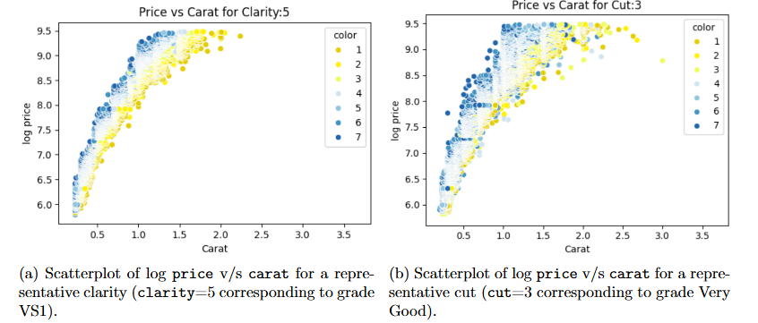
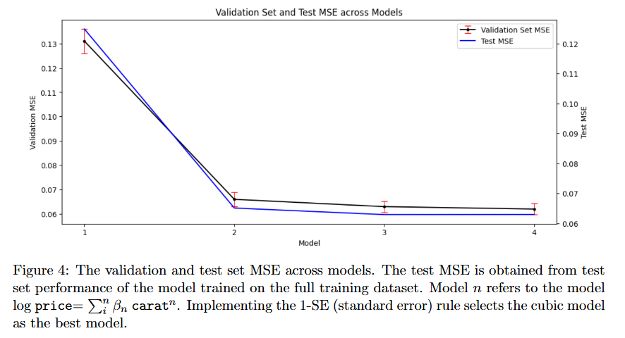
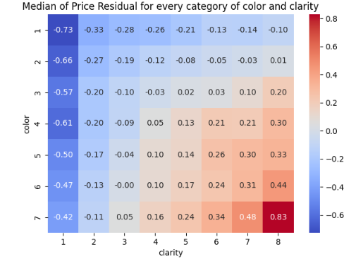
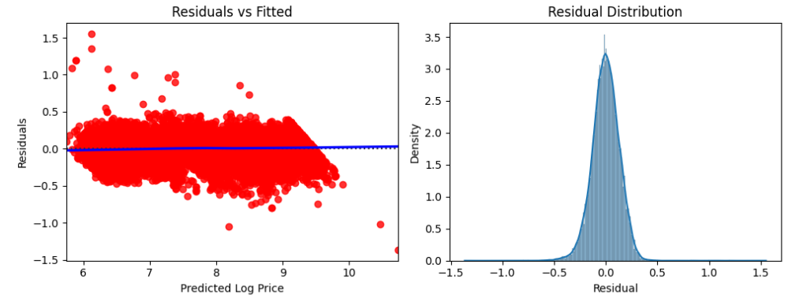
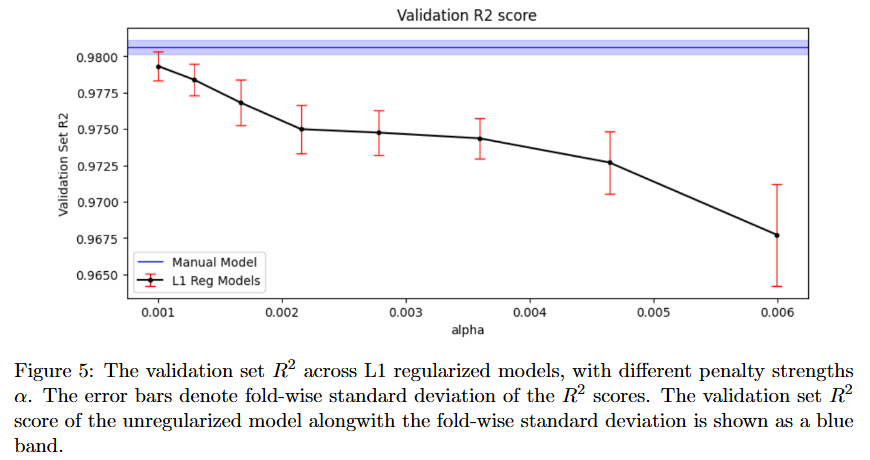

# Statistical Modeling of Diamond Prices: An EDA-Guided Regression Analysis

## Project goal

Develop an interpretable statistical model for predicting diamond prices using exploratory data analysis (EDA), feature engineering, cross-validation and explore role of regularization (Ridge and Lasso) and principal component analysis (PCA).

## Dataset
The dataset consists of 
- 53940 entries of diamond features and their price.

Features include 
- Carat : diamond weight 
- Cut, Color and Clarity of the diamond (Categorical variables)
- Geometric features such as x,y,z : Length, Width, Height of cut
- Price of the diamond

# Repository Structure
├── notebooks ── Diamond_Price_Regression.ipynb

├── report ── Diamond_Price_Regression_Report.pdf

├── Figures
└── README.md

## Main Results
  See  Diamond_Price_Regression_Report.pdf for detailed report of project.

The project develops an interpretable regression model for diamond price prediction through a statistically motivated modeling workflow.

- Exploratory data analysis identified **carat** as the dominant determinant of price. Cross-validation selected a **cubic polynomial** in carat as the optimal representation of **log price** dependence. Higher-order polynomial and spline models provided no meaningful improvement.

  

  

- Removing the dominant carat trend revealed weaker but significant effects of **cut**, **color**, and **clarity**, together with interaction effects between **carat × clarity** and **clarity × color**, which were incorporated through feature engineering.

  

- The final OLS model achieved a **test-set $R^2 \sim 98.1\%$** while remaining simple and interpretable. Residual diagnostics indicated no major systematic structure left unexplained, and bootstrap resampling demonstrated excellent prediction stability.

  

- Ridge and LASSO regression were used to investigate the robustness of the selected features. LASSO retained essentially the same predictors as the manually engineered model, indicating that the EDA-guided feature selection captured the dominant predictive information despite searching a much smaller model space.

  

- Principal Component Analysis revealed that the original variables are organized around three physically interpretable latent factors:
  - **Size** (carat, x, y, z)
  - **Cut geometry** (cut, depth, table)
  - **Quality** (color, clarity)

  Principal Component Regression did not improve predictive performance, illustrating that dimensionality reduction is unnecessary for this low-dimensional, high-sample-size dataset.